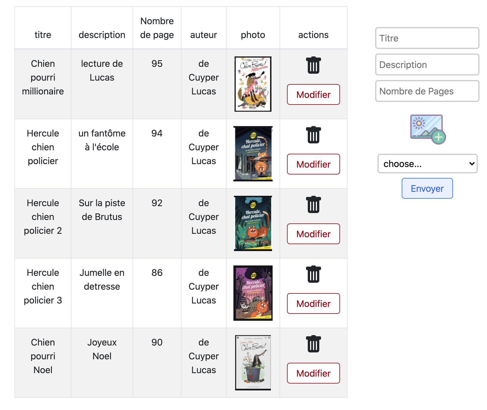

[![MIT License][license-shield]][license-url]


<!-- PROJECT LOGO -->
<br />
<p align="center">
  <a href="https://github.com/othneildrew/Best-README-Template">
    <!--  -->
    <!--  -->
  </a>

  <h3 align="center">Ebook Mongo Express React Node</h3>


<!-- TABLE OF CONTENTS -->
## Table of Contents

* [About the Project](#about-the-project)
  * [Built With](#built-with)
* [Getting Started](#getting-started)
  * [Prerequisites](#prerequisites)
  * [Installation](#installation)
* [Contributing](#contributing)
* [License](#license)
* [Contact](#contact)


<!-- ABOUT THE PROJECT -->
## About The Project

### Overview

  

### Built With

* [Node](https://nodejs.org/dist/latest-v12.x/docs/api/)
* [React](https://fr.reactjs.org/)
* [Express](https://expressjs.com/fr/)
* [Mongo](https://www.mongodb.com/fr)
* [Recoil](https://recoiljs.org/) => state
* [React Boostrap](https://react-bootstrap.github.io/)


<!-- GETTING STARTED -->
## Getting Started

### Prerequisites

* node
* yarn

### Installation

1. Clone the repo
```sh
git clone https://github.com/decuyperanthony/Ebook-app-MERN-uploadFile
```

2. Database
```sh
database : Mongo
name : "biblio"
```
2. To init server
```sh
cd server
cp .env.example .env
npm install
npm start
```
3. To init client
```sh
cd client
yarn
yarn start
```


<!-- CONTRIBUTING -->
## Contributing
really ? :)


<!-- LICENSE -->
## License

Distributed under the MIT License. See `LICENSE` for more information.


<!-- CONTACT -->
## Contact

Anthony de Cuyper - [linkedin](https://www.linkedin.com/in/anthony-de-cuyper/) - decuyperanthony@gmail.com

Project Link: [https://github.com/decuyperanthony/Ebook-app-MERN-uploadFile](https://github.com/decuyperanthony/star-wars)


